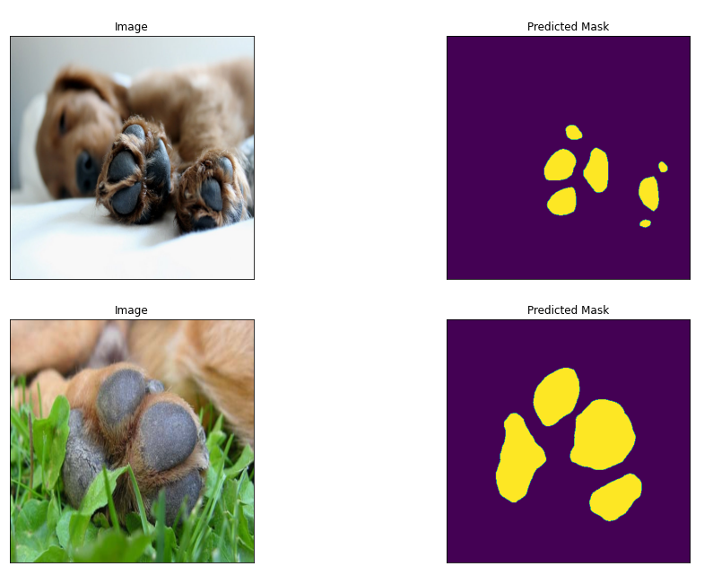

# 🐾 paw-segmentation
🐾 Semantic segmentation of paws from cute pet images

  

    <em>🐾 Semantic segmentation of paws from cute pet images (PyTorch)</em>

---
### 🐾 Paw Segmentation
🐾 Semantic segmentation of paws from cute pet images (segmentation_models.pytorch)

### Materials
 * dataset: [data](https://gitlab.com/zabir.al.nazi/paw_data/-/blob/main/paw_data.zip)
 * training notebook: [notebook](https://github.com/zabir-nabil/paw-segmentation/blob/main/paw_training.ipynb)
 * model weight: [model.pt](https://gitlab.com/zabir.al.nazi/paw_data/-/blob/main/best_model.pth)
 * fastapi server: [serve.py](https://github.com/zabir-nabil/paw-segmentation/blob/main/serve.py)